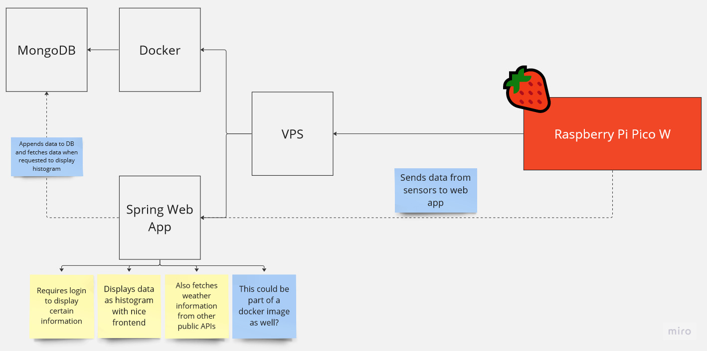
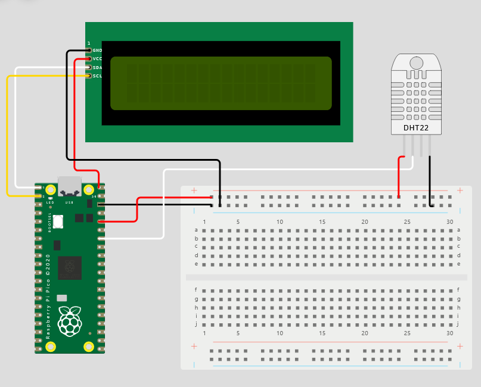

# Weather Station
This is code for my Raspberry Pi Pico microcontroller written in MicroPython.

# Architecture

# Circuit

# File structure

### Pico
Source files for Pico are inside `pico` directory.

### Server
Source files for server part of the project are inside `server` directory.

# External services
- Weather data powered by: https://open-meteo.com/en

# Diary

### 5 May 2023
As it turned out a lot of issues with not being able to read data from sensors were
related to the fact that the LCD display requires 5V while Pico can only supply 3.3V.
Due to this issue I have to disconnect the LCD display and most likely will
purchase an e-ink display that only requires 3.3V. However given that all data
will be available via web app this is not a necessity at the moment. Updated the
circuit diagram to match current state of the circuit. I also had to add a pull up
resistor to make the DHT11 sensor more stable.